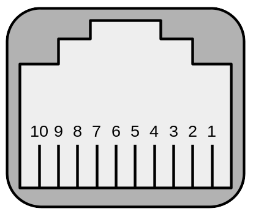

# KAIDI_KDDY094_IoT Work in progress

## Research

### Control Panels

A the time of writing, KAIDI sells [5 different control panels (handsets)](https://kaidiofficeusa.com/products/spec-sheets/). The features can differe per model. Some even have a RJ45 (8P8C) connector and others RJ50 (10P10C).

#### KDH126

The KDH126 uses the RJ45 connector with only three pins in use.
On the RJ50 connector there are pin 5 for 5V power.
Pin 6 for the up signal und pin 9 for down.
On the RJ45 connector there are respective pin 4,5,8.

To move the desk up and down with the KDH126, the up or down pins are connected to 5V (3.3V works too).

#### KDH064

The KDH064 is more complicated and does not direktly bridge the pins to send a signal to the control box as the KDH126 does.

### Control Box KDDY094

| RJ50 pin | Name       | KDH126 | KDH064C |
| -------- | ---------- | ------ | ------- |
| 10       | ENABLE     |        |    X    |
| 9        | DOWN       |    X   |         |
| 8        | TX         |        |    X    |
| 7        | RX         |        |    X    |
| 6        | UP         |    X   |         |
| 5        | +5V (VDD)  |    X   |         |
| 4        | --         |        |         |
| 3        | GND        |        |    X    |
| 2        | +5V (VDD)  |        |    X    |
| 1        | --         |        |         |

### Execute a command

The control box only accepts commands while the ENABLE (10) pin is high. On setting high you should hear a relay click.
- UART baud rate: 9600

#### Command list

| Command name      | Start | Type   | Payload   | Checksum  |    End    |
| ----------------- | ----- | ------ | --------- | --------- | --------- |
| Current hight     | `01`  | `00`   | `00` `00` |    `01`   | `16` `68` |
| Up                | `01`  | `01`   | `00` `00` |    `02`   | `16` `68` |
| Down              | `01`  | `02`   | `00` `00` |    `03`   | `16` `68` |
| get current hight | `01`  | `03`   | `00` `00` |    `04`   | `16` `68` |
| Preset 1          | `01`  | `06`   | `00` `00` |    `07`   | `16` `68` |
| Preset 2          | `01`  | `07`   | `00` `00` |    `08`   | `16` `68` |
| Preset 3          | `01`  | `08`   | `00` `00` |    `09`   | `16` `68` |
| Set preset 1      | `01`  | `0a`   | `00` `00` |    `0b`   | `16` `68` |
| Set preset 2      | `01`  | `0b`   | `00` `00` |    `0c`   | `16` `68` |
| Set preset 3      | `01`  | `0c`   | `00` `00` |    `0d`   | `16` `68` |
| Set referenz hight| `01`  | `10`   | `00` `00` |    `11`   | `16` `68` |

##### Checksum

The checksum is the sum over start up to payload byte with only the last byte used.

##### Current hight
This command is the only message send from the control box to the control panels. The payload contains the current hight in referenze to it's lowest postition.
So if the table ist as far down as possible, the payload will be `00` `00`. From there on the hight will be described in `0x0a` steps. So the next hight will be `00` `0a` and so on.

##### Set referenz hight
If you set a referenz hight, so that the control panel shows the right hight, the control panel will send this message to the control box. But don't ask me why. Because the control box does not use theis information. Or at least I haven't found yout where it is used.

